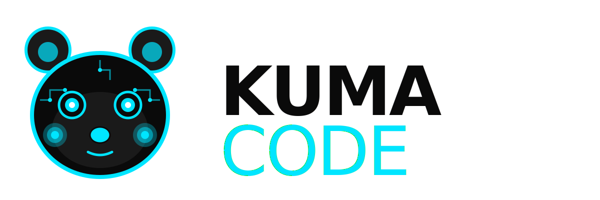

  

  <b>The only AI coding workspace where agents work in parallel on YOUR machine — not in someone else's cloud.</b>

  <a href="https://zerosec-ai.com">Website</a>
  ·
  <a href="https://github.com/zerosecai/kuma-code/discussions">Discussions</a>
  ·
  <a href="https://github.com/zerosecai/kuma-code/issues">Issues</a>
  ·
  <a href="ATTRIBUTION.md">Lineage</a>
  ·
  <a href="PRIVACY.md">Privacy</a>
  ·
  <a href="SECURITY.md">Security</a>

  
  
  

---

Kuma Code is a multi-agent coding IDE that runs on your hardware. Plan, write, and review with three AI agents working in parallel — using local models for the daily grind and bursting to the cloud only when a problem actually needs it. Your code stays on your machine unless you choose otherwise.

## ✨ Why Kuma Code?

### Hybrid LLM — local first, cloud when needed

Kuma Code routes each request between Ollama Cloud, a local Ollama instance, or LM Studio depending on the task. Easy refactors and code lookups run on a 1.5B local model; complex planning bursts to the cloud. You set the policy, the router enforces it. No code leaves your machine unless you wire up a cloud provider yourself.

### 1 GB modular skill packs

Each skill pack ships about 1 GB of structured domain knowledge — TypeScript + React, Python + Django, Go stdlib — indexed by a two-level table-of-contents lookup. The skill retriever pulls the right paragraph into the prompt before the model runs, so a 1.5B model with the right pack performs comparably to a 70B-class model on its specialty. Install only the packs you need; nothing else takes disk.

The first pack — TypeScript + React + Vite — is being built in the open at [kuma-pack-tsreact](https://github.com/zerosecai/kuma-pack-tsreact). [v0.1.0-alpha](https://github.com/zerosecai/kuma-pack-tsreact/releases/tag/v0.1.0-alpha) contains 216 chunks from real TypeScript / React / Vite docs, with semantic search validated against 5/5 test queries. Scaling toward production size continues; extension integration follows.

### Three-agent pipeline

Every task flows through Planner → Coder → Reviewer. Each agent runs the model best suited to its job: a small fast model for routine plans, a larger model for tricky code, and a thorough model for review. Stages are checkpointed, parallelizable up to ten coders, and replayable from any point if something goes sideways.

### Built for the developer workstation, not the data center

Kuma Code targets a 32 GB RAM / 4 TB SSD developer machine — the kind of hardware a serious engineer already owns. No GPU cluster required. No "self-host means k8s" pretence. Skill packs sit on disk, models load on demand, and the runtime stays out of your way.

### TypeScript + React + Vite as a first-class citizen

The MVP skill pack is the TS+React+Vite stack with Vitest integration, Vite-aware HMR awareness, and type-aware refactoring. Other stacks are coming, but this is the one we use to dogfood every commit, so it gets the most love.

## Quick start

The marketplace listing is on the way. Until then, the extension can be installed from a local `.vsix` build (see [CONTRIBUTING.md](CONTRIBUTING.md) for the dev-host workflow).

After install, point Kuma at your provider of choice:

- **Ollama Cloud** — get an API key from [ollama.com](https://ollama.com), paste into settings.
- **Local Ollama** — `ollama serve` running on `localhost:11434` is auto-detected.
- **LM Studio** — `localhost:1234/v1` is auto-detected too.

A quickstart video and full docs site land alongside the marketplace publish.

## For teams

Kuma Code is built so engineering teams with real compliance requirements can adopt it without their security team raising eyebrows.

- **Air-gapped operation.** Configure the provider list to local-only (Ollama or LM Studio). The agent runtime, skill index, and tool execution all run on the workstation. There are no required outbound connections.
- **Data residency.** Code, prompts, and edits stay on the developer's machine unless an explicitly-configured cloud provider is selected. There is no Kuma-operated gateway between you and your model — the router talks straight to the provider you point it at.
- **Hardware footprint.** A reference workstation of 32 GB RAM and 4 TB SSD comfortably holds the runtime, the model cache, and a working set of skill packs. We don't require a GPU cluster, but a workstation GPU helps with larger local models.
- **Audit logs and SOC 2 posture.** Detailed audit logging and formal compliance attestations are on the roadmap. If you're evaluating Kuma for a regulated environment and need a specific control mapped out today, open a Discussion or email the contact below — we'll be straight with you about what's done and what isn't.

## Built on giants

Kuma Code is a fork chain. We didn't start from scratch and we don't pretend we did. See [ATTRIBUTION.md](ATTRIBUTION.md) for the full lineage and what each ancestor contributed:

- **[Kilo Code](https://github.com/Kilo-Org/kilocode)** — direct upstream. The multi-platform IDE foundation, agent runtime, tool ecosystem.
- **[Roo Code](https://github.com/RooVetGit/Roo-Code)** — Kilo's parent. Custom modes and orchestration patterns.
- **[Cline](https://github.com/cline/cline)** — the original. The agentic coding loop and tool execution model.

All three are MIT-licensed, and so is Kuma Code.

## Contributing

Contributions are welcome — whether code, skill packs, docs, or bug reports. See [CONTRIBUTING.md](CONTRIBUTING.md) for the dev-environment setup, PR conventions, and commit message format. The fastest way to get involved is to open a [Discussion](https://github.com/zerosecai/kuma-code/discussions) or file an [Issue](https://github.com/zerosecai/kuma-code/issues).

## License

[MIT](LICENSE). Use it, fork it, ship it. The upstream Kilo Code copyright is preserved alongside ours, as the MIT terms require.

## Contact

- **General questions and inquiries:** kuma@zerosec-ai.com
- **Security vulnerabilities:** see [SECURITY.md](SECURITY.md) for our coordinated-disclosure process and contact.
